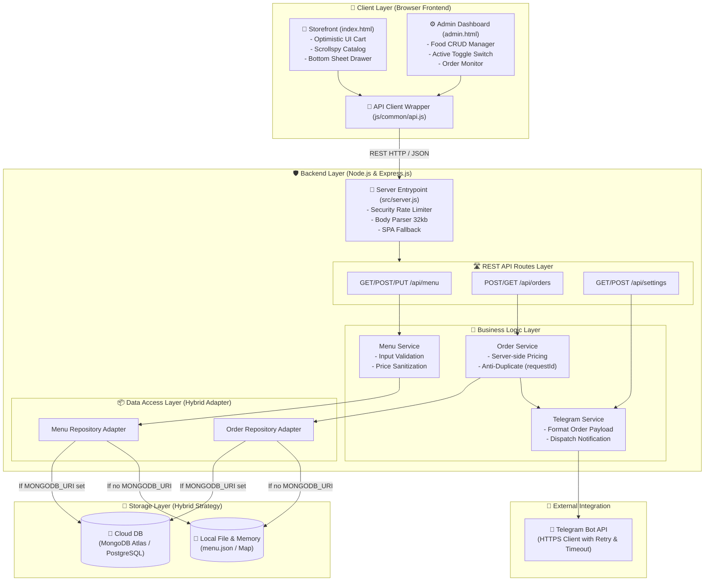

# 🏗️ Food Order Bridge - System Architecture & Engineering Standards

Tài liệu chuẩn hóa kiến trúc phần mềm, các tiêu chuẩn thiết kế UI/UX, Backend, Database và hạ tầng triển khai trên **Render**.

---

## 🚀 1. Phân Tích Môi Trường & Giải Pháp Database Tối Ưu Trên Render

Khi triển khai ứng dụng Web Service trên **Render**, chúng ta có các lựa chọn Database sau:

| Giải Pháp Database | Loại Môi Trường Render | Thời Gian Sử Dụng Miễn Phí | Đánh Giá Tối Ưu Cho Dự Án |
| :--- | :--- | :--- | :--- |
| **Render Native PostgreSQL** | Managed DB tích hợp sẵn trên Render | 90 ngày (Free tier tự xóa sau 90 ngày) | ⚠️ Cần nâng cấp trả phí sau 90 ngày nếu muốn dùng tiếp. |
| **Render Persistent Disk + SQLite/JSON** | Đĩa cứng đính kèm Web Service | Không có trên Free Web Service | 🛑 Yêu cầu tài khoản Render trả phí ($7/tháng trở lên). |
| **MongoDB Atlas (Cloud M0)** *(Đề xuất số 1)* | Database Cloud độc lập dạng NoSQL/JSON | **Miễn phí vĩnh viễn (512MB)** | ⭐⭐⭐⭐⭐ **Tối ưu nhất**: Cấu trúc JSON trùng khớp với `menu.json` & `orders.json`, không hết hạn. |
| **Neon.tech / Supabase (Cloud Postgres)** | Database Cloud độc lập Serverless Postgres | **Miễn phí vĩnh viễn (0.5GB)** | ⭐⭐⭐⭐ **Tối ưu**: Tốt nếu muốn chuẩn SQL quan hệ, kết nối qua `DATABASE_URL`. |

> 💡 **Kết luận kiến trúc:** Dự án áp dụng **Hybrid Repository Adapter Pattern**. 
> - Khi chạy trên **Render**: Kết nối đến MongoDB Atlas (`MONGODB_URI`) hoặc Neon Postgres (`DATABASE_URL`).
> - Khi chạy tại **Local (Dev)**: Tự động **Fallback** dùng File JSON (`menu.json`) & In-Memory Map.

---

## 📐 2. Cấu Trúc Hoạt Động Của Hệ Thống (Architecture Flowchart)

---

## 💎 3. Các Tiêu Chuẩn Thiết Kế Phần Mềm Chi Tiết

### 🎨 A. Standard Thiết Kế Giao Diện UI/UX
- **Công nghệ cốt lõi**: Vanilla HTML5 + Vanilla CSS3 (Custom Properties / Design Tokens) + Native ES6 Modules. Không phụ thuộc nặng vào CSS/JS Framework ngoài để đạt tốc độ tải $100/100$ Lighthouse Performance.
- **Hệ thống Design Tokens (CSS Variables)**:
  - **Quy tắc khoảng cách (Rule of 8)**: `space-1` ($4\text{px}$), `space-2` ($8\text{px}$), `space-3` ($12\text{px}$), `space-4` ($16\text{px}$), `space-6` ($24\text{px}$).
  - **Bảng màu Tailored**: Dark Theme sang trọng với màu nhấn HSL Emerald Green (`#10b981`), Amber Orange, Neutral Zinc background.
  - **Typography Modern**: Phông chữ hệ thống hiện đại, tự động responsive theo viewport (`clamp()`).
- **Trải nghiệm người dùng (UX Standards)**:
  - **Optimistic UI Updates**: Tăng/giảm số lượng món ăn và cập nhật tổng tiền lập tức trên giao diện với độ trễ $0\text{ms}$.
  - **Mobile-First Layout**: Thanh Navigation cuộn ngang sticky, Mobile Bottom Sheet trượt mượt mà cho giỏ hàng và đặt hàng.
  - **Component Architecture**: Quy tắc đặt tên CSS dạng BEM (`.btn`, `.btn-primary`, `.admin-card`, `.modal-overlay`).

### ⚙️ B. Standard Thiết Kế Backend
- **Ngôn ngữ & Runtime**: Node.js (CommonJS) + Express.js Web Server.
- **Mô hình kiến trúc**: **Layered Architecture (N-Tier Architecture)** chia tách độc lập 4 tầng:
  1. `Routes`: Tiếp nhận HTTP Request và phản hồi JSON.
  2. `Services`: Chứa Business Logic (tính giá Server-side, validate dữ liệu đầu vào).
  3. `Repositories`: Đóng gói việc truy vấn dữ liệu (Data Access Layer).
  4. `Integrations`: Xử lý giao tiếp API với dịch vụ bên ngoài (Telegram Bot HTTPS Client).
- **Tiêu chuẩn An ninh & Validation (Security Standards)**:
  - **Tính giá Server-side**: Giá sản phẩm tuyệt đối không lấy từ Client gửi lên mà được tra cứu và tính toán lại 100% tại Server.
  - **Chống trùng đơn hàng (Idempotency)**: Client sinh mã `requestId` (UUID v4), Server kiểm tra tránh tạo trùng đơn khi bấm nhiều lần hoặc lag mạng.
  - **Rate Limiting & Body Limits**: Giới hạn tối đa $10$ order requests/phút mỗi IP (`express-rate-limit`), giới hạn JSON Payload $\le 32\text{KB}$.

### 💾 C. Standard Thiết Kế Database (Hybrid Strategy)
- **Chuẩn kết nối**: Tự động phát hiện môi trường qua biến `MONGODB_URI` hoặc `DATABASE_URL`.
- **Schema & Data Models**:
  - `Category`: `{ id: String (PK), name: String, slug: String, description: String, sortOrder: Number, active: Boolean, createdAt: Date, updatedAt: Date }`
  - `MenuItem`: `{ id: String (PK), name: String, categoryId: String (FK), category: String (Snapshot), price: Number, discountPercent: Number, stockQuantity: Number, customizationOptions: Array [{ id, name, defaultIncluded, active, sortOrder }], image: String, description: String, active: Boolean, updatedAt: Date }`
  - `Order`: `{ id: String (PK), requestId: String (Index Unique), fulfillmentType: String ('DELIVERY' | 'DINE_IN'), customerName: String, phone: String, address: String, note: String, items: Array [{ productId, name, originalUnitPrice, discountPercent, unitPrice, quantity, customization: { excludedOptions: [{ id, name }], includedOptions: [{ id, name }] } }], totalPrice: Number, telegramSent: Boolean, createdAt: Date }`
  - `Settings`: `{ key: String, telegramBotToken: String, telegramChatId: String, shopName: String, timezone: String }`
  - `User`: `{ username: String, passwordHash: String, role: String, active: Boolean }`

---

## ☁️ 4. Cấu Hình Deploy Render Miễn Phí Vĩnh Viễn

- **Build Command**: `npm install`
- **Start Command**: `npm start`
- **Health Check Path**: `/health`
- **Environment Variables**:
  - `NODE_ENV=production`
  - `SHOP_NAME=Food Order Shop`
  - `ORDER_TIMEZONE=Asia/Bangkok`
  - `MONGODB_URI=mongodb+srv://<user>:<password>@cluster.mongodb.net/food-order?retryWrites=true&w=majority`
  - `TELEGRAM_BOT_TOKEN=<Token_tu_BotFather>`
  - `TELEGRAM_CHAT_ID=<ID_Nhom_Telegram>`
