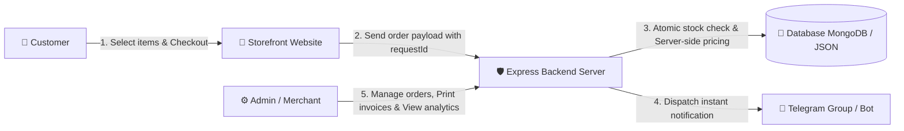

# 🍜 Food Order Bridge

> **Smart food ordering & management system with real-time Telegram integration**, built with a Mobile-First UI/UX and a Node.js + Express backend supporting a hybrid data architecture (MongoDB Cloud / Local JSON).

---

## 📋 Table of Contents
1. [Prerequisites](#-prerequisites)
2. [System Workflow](#-system-workflow)
3. [Key Features](#-key-features)
4. [Local Setup Guide](#-local-setup-guide)
5. [User Guide](#-user-guide)
6. [Deployment to Render](#-deployment-to-render)
7. [Directory Structure](#-directory-structure)

---

## 🛠 Prerequisites

- **Node.js**: `v18.x` or higher
- **npm**: `v8.x` or higher
- **Telegram Bot Token & Chat ID**: For receiving instant order notifications ([How to create a Telegram Bot with @BotFather](https://core.telegram.org/bots#how-do-i-create-a-bot)).
- **MongoDB Atlas URI**: *(Optional for Production)* - The system automatically falls back to local JSON files (`src/data/`) during local development.

---

## 🔄 System Workflow



### Workflow Summary:
1. **Customer Order (Storefront)**: Customers browse the menu, customize dish components (toppings/exclusions), select fulfillment type (Delivery or Dine-in), and submit their order.
2. **Secure Server Processing**: The backend validates the request, performs atomic stock deduction to prevent overselling, recalculates item prices server-side, and enforces idempotency via unique `requestId` (UUID v4).
3. **Instant Telegram Notification**: Upon success, a formatted order receipt is dispatched directly to the merchant's Telegram group or channel.
4. **Order Management & Printing (Admin Dashboard)**: Merchants and staff log into the admin dashboard to manage order statuses, print receipts (formatted for thermal 80mm printers & A4 paper), and monitor revenue analytics.

---

## ⭐ Key Features

### 🛒 1. Customer Storefront (`index.html`)
- **Mobile-First Responsive Design**: Optimized for smartphones, tablets, and desktop displays.
- **Scrollspy Navigation & Search**: Sticky category bar with auto-highlighting scrollspy and instant product search.
- **Customizable Item Options**: Select or exclude ingredients and toppings (e.g., crispy shallots, garlic oil, soy sauce) independently per item.
- **Real-Time Inventory Control**: Out-of-stock items (`stock = 0`) display an "Out of Stock" badge and disable cart additions automatically.
- **Promotional Discounts**: Clear badge indicators (`-XX%`), original vs. discounted prices, and total savings display.
- **Bottom Sheet Drawer & Floating Cart Bar**: Mobile bottom sheet drawer for smooth item quick-view and checkout.

### ⚙️ 2. Admin Dashboard (`admin.html`)
- **Authentication & Role-Based Control**: Secure JWT authentication supporting Admin and Staff roles.
- **Menu & Category Management**: Full CRUD operations for menu items, categories, pricing, stock levels, customization options, and availability toggles (`active`).
- **Invoice Preview & Thermal Printing**: Modal preview and instant one-click browser printing (`window.print()`) pre-styled for 80mm thermal receipts and A4 invoices.
- **Sales Analytics & PDF Export**: Detailed revenue reports by timeframe, top-selling items, and downloadable PDF report generation.
- **Telegram Bot Settings & Webhook**: Interactive settings tab for Bot Token & Chat ID, connection testing, and automated Telegram webhook reporting commands.

### 🛡 3. Backend & Infrastructure Security
- **Anti-Overselling Concurrency Protection**: Atomic inventory decrements on MongoDB and Async Mutex Locks in JSON mode.
- **Strict Server-Side Price Calculation**: Ensures zero client-side pricing tampering.
- **Idempotency Safeguard**: Prevents duplicate orders from rapid button taps or network retries using UUID `requestId`.
- **Hybrid Data Architecture**: Seamless switching between MongoDB Atlas (Production) and local JSON storage (Development).

---

## 🚀 Local Setup Guide

### Step 1: Clone Repository & Install Dependencies
```bash
git clone https://github.com/Ninh-Duong/food-order-bridge.git
cd food-order-bridge
npm install
```

### Step 2: Create Environment Configuration (`.env`)
Create a `.env` file in the root directory (refer to `.env.example`):
```env
PORT=3000
NODE_ENV=development
SHOP_NAME=Food Order Shop
ORDER_TIMEZONE=Asia/Bangkok

# Initial Admin Credentials (Created automatically on first launch)
AUTH_SECRET=replace-with-a-random-secret-at-least-32-characters
ADMIN_USERNAME=admin
ADMIN_PASSWORD=adminpassword123

# Telegram Integration (Optional for local testing)
TELEGRAM_BOT_TOKEN=123456789:xxxxxxxxxxxxxxxxxxxxxxxxxxxxxxxxxxx
TELEGRAM_CHAT_ID=-1001234567890
```

### Step 3: Run the Application
```bash
# Start in Development Mode (with hot-reload)
npm run dev

# Or start in Production Mode locally
npm start
```

### Step 4: Access the Application
- 🛒 **Customer Storefront**: [http://localhost:3000](http://localhost:3000)
- ⚙️ **Admin Dashboard**: [http://localhost:3000/admin.html](http://localhost:3000/admin.html)
  - *Default Credentials*: `admin` / `adminpassword123` *(Please change password after initial setup)*.

---

## 📖 User Guide

### 📱 For Customers:
1. Open the storefront at [http://localhost:3000](http://localhost:3000).
2. Browse categories or use the search bar to select items.
3. Click an item to customize options (add or remove ingredients), then click **Add to Cart**.
4. Open the Cart, choose **Delivery** or **Dine-In**, enter contact details, and click **Place Order**.

### ⚙️ For Merchants / Administrators:
1. Navigate to [http://localhost:3000/admin.html](http://localhost:3000/admin.html) and log in.
2. **Telegram Bot Setup**: Go to the **🤖 Telegram Settings** tab, input your Bot Token & Chat ID -> Click **Save Settings** -> Click **Send Test Message**.
3. **Menu Management**: Go to the **Menu** tab to add new items, update prices, manage stock quantities, or toggle item availability.
4. **Order Processing**: Go to the **Orders** tab to monitor incoming orders, update status, and click **🖨 Print Invoice** for fulfillment.
5. **Analytics & Staff Accounts**: View sales reports, export PDF summaries, or manage staff user accounts.

---

## ☁️ Deployment to Render

The repository includes a ready-to-use `render.yaml` blueprint for 1-click deployment on **Render**:

1. Push your repository to **GitHub**.
2. Log in to [Render.com](https://render.com) -> Click **New +** -> Select **Blueprint**.
3. Connect your `food-order-bridge` repository.
4. Render automatically detects `render.yaml` with the following configuration:
   - **Build Command**: `npm install`
   - **Start Command**: `npm start`
   - **Health Check Path**: `/health`
5. Configure Environment Variables in the Render Dashboard:
   - `AUTH_SECRET`: Random long string (at least 32 characters)
   - `ADMIN_USERNAME` & `ADMIN_PASSWORD`: Initial Admin login credentials
   - `MONGODB_URI`: MongoDB Atlas connection string (e.g., `mongodb+srv://<user>:<pass>@cluster0.mongodb.net/food-order`)
   - `TELEGRAM_BOT_TOKEN` & `TELEGRAM_CHAT_ID`: Telegram Bot configuration values
6. Click **Apply**. Render will automatically build and deploy your application.

---

## 📁 Directory Structure

```text
food-order-bridge/
├── public/                     # Static Frontend Assets
│   ├── index.html              # Customer Storefront SPA
│   ├── admin.html              # Admin Dashboard SPA
│   ├── css/                    # Modular CSS & Design Tokens
│   └── js/                     # Client JavaScript Modules (Storefront & Admin)
├── src/                        # Express / Node.js Backend Codebase
│   ├── server.js               # Application Entry Point & Server Listener
│   ├── config.js               # Environment & Runtime Settings Loader
│   ├── db.js                   # MongoDB Connection & Fallback Handler
│   ├── models.js               # Mongoose Schemas (Category, MenuItem, Order, Settings, User)
│   ├── routes/                 # REST API Routers (menu, orders, settings, auth, reports, etc.)
│   ├── services/               # Business Logic Layer (Order, Menu, Auth, Telegram, Report PDF)
│   ├── repositories/           # Data Access Layer (Hybrid Storage Adapter)
│   └── integrations/           # External API Clients (Telegram HTTPS Client)
├── package.json                # NPM Scripts & Dependencies
├── render.yaml                 # Render Blueprint Deployment Spec
└── README.md                   # Project Documentation
```

---

## 📝 License
This project is licensed under the **MIT License**.
