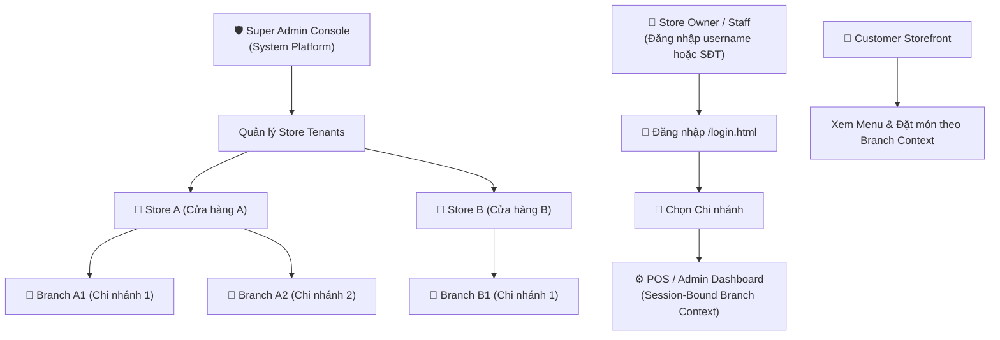

# 🍜 Food Order Bridge — Multi-Tenant Food POS System

> **Smart Multi-Tenant Food Ordering & POS Management System (Store → Branch)** with real-time Telegram integration, username/phone authentication, multi-branch context switcher, and Super Admin Console, built with Express.js and hybrid data storage (MongoDB Cloud / Local JSON Fallback).

---

## 📋 Table of Contents
1. [Multi-Tenant Architecture](#-multi-tenant-architecture)
2. [Prerequisites](#-prerequisites)
3. [System Workflow](#-system-workflow)
4. [Key Features](#-key-features)
5. [Local Setup & Configuration Guide](#-local-setup--configuration-guide)
6. [Access URLs & Navigation](#-access-urls--navigation)
7. [Documentation Map](#-documentation-map)
8. [Directory Structure](#-directory-structure)
9. [Deployment to Render](#-deployment-to-render)

---

## 🏢 Multi-Tenant Architecture

The system operates on a **Shared Database with Discriminator Columns (`storeId` and `branchId`)** architecture, enforcing strict data isolation and tenant scoping:



### Roles & Permission Hierarchy
- **SUPER_ADMIN**: Platform administrator. Creates/suspends Store tenants, manages branch limits, resets owner accounts, views global audit logs.
- **STORE_OWNER**: Owns one Store tenant and all its Branches. Manages Store catalog, price overrides, branch stock, order history, analytics, and staff accounts.
- **STAFF**: Assigned to specific Branches. Manages branch inventory, order fulfillment, status updates, and daily sales reports.
- **CUSTOMER**: Accesses a Branch storefront to view menu items, customize options, place orders, and make payments.

---

## 🛠 Prerequisites

- **Node.js**: `v18.x` or higher
- **npm**: `v8.x` or higher
- **Telegram Bot Token & Chat ID**: *(Optional)* For receiving order notifications & reports.
- **MongoDB Atlas URI**: *(Optional for Production)* - The system automatically falls back to local JSON files (`src/data/`) during local development.

---

## 🔄 System Workflow

1. **Merchant Login & Branch Context**: Store Owners and Staff log in via username or SĐT E.164 (`/login.html`), select an active Branch, and receive an HMAC-signed JWT session bound to their `storeId` and `branchId`.
2. **Fail-Fast Tenant Context Guard**: All repository methods enforce `tenantContext = { storeId, branchId }` validation. Queries missing `storeId` fail immediately (`TenantContextMissingError`), guaranteeing zero cross-tenant data leaks.
3. **Customer Order Placement**: Customers order through the storefront. The backend performs atomic stock deduction, calculates prices server-side, and enforces idempotency via unique `requestId`.
4. **Super Admin Management**: Super Admins manage stores, branch limits, and audit logs via `/super-admin/index.html`.

---

## ⭐ Key Features

### 🛡️ 1. Multi-Tenant Data Isolation & Security (P0)
- **Discriminator Column Isolation**: `storeId` and `branchId` embedded in all Mongoose Schemas with compound unique indexes (`{ storeId, id }`, `{ storeId, branchId, id }`).
- **Session-Bound Context**: Context is extracted exclusively from signed JWT cookies, never trusted from client request bodies.
- **Fail-Fast Guard**: Throw `TenantContextMissingError` if repository invocations lack tenant context.

### 🔑 2. Phone Auth & Branch Selection (`login.html`)
- **E.164 Normalization**: Normalizes inputs (e.g. `0912 345 678`, `84912345678`) to `+84912345678` automatically.
- **Interactive Branch Switcher**: Displays available active branches for the authenticated user before issuing the active session token.

### 🛡️ 3. Super Admin Console (`/super-admin/index.html`)
- **Dedicated Auth Realm**: Isolated from merchant databases with environment secrets (`SUPER_ADMIN_PHONE`, `SUPER_ADMIN_PASSWORD_HASH`, `SUPER_ADMIN_AUTH_SECRET`).
- **Store Tenant Management**: Create stores, toggle status (`ACTIVE` / `SUSPENDED`), adjust `maxBranches` and subscription plans.
- **Audit Logging**: Tracks system actions (`actorId`, `action`, `target`, `timestamp`).

### ⚙️ 4. Merchant POS & Admin Dashboard (`admin.html`)
- **Branch Context Badge**: Header indicator showing active Store & Branch.
- **Menu & Inventory Control**: Manage categories, catalog items, price overrides, and stock per branch.
- **Order Fulfillment & Printing**: Real-time order tracking, receipt printing (80mm thermal / A4), and PDF reports.

---

## 🚀 Local Setup & Configuration Guide

### Step 1: Clone Repository & Install Dependencies
```bash
git clone https://github.com/Ninh-Duong/food-order-bridge.git
cd food-order-bridge
npm install
```

### Step 2: Configure Environment Variables (`.env`)
Create a `.env` file in the root directory (refer to `.env.example`):
```env
PORT=3000
NODE_ENV=development
SHOP_NAME=Food Order Multi-Tenant Shop
ORDER_TIMEZONE=Asia/Ho_Chi_Minh

# Auth Signing Secret (At least 32 characters)
AUTH_SECRET=your-random-32-character-auth-secret-string

# Initial Admin Credentials (Legacy / Bootstrap)
ADMIN_USERNAME=admin
ADMIN_PASSWORD=adminpassword123

# Super Admin Credentials
SUPER_ADMIN_PHONE=0900000000
SUPER_ADMIN_PASSWORD=SuperAdmin123!
SUPER_ADMIN_AUTH_SECRET=super_admin_secret_key_32chars_minimum_spec

# MongoDB Atlas URI (Optional - Falls back to JSON files locally)
# MONGODB_URI=mongodb+srv://<user>:<pass>@cluster0.mongodb.net/food-order
```

### Step 3: Run Application & Test Suite
```bash
# Run 100% Automated Test Suite (161 tests across 30 test suites)
npm test

# Start Server in Development Mode (Hot Reload)
npm run dev
```

---

## 🌐 Access URLs & Navigation

| Route / Page | Role / Target | URL |
| :--- | :--- | :--- |
| 🛒 **Customer Storefront** | Customer | [http://localhost:3000](http://localhost:3000) |
| 🔑 **Merchant Phone Login** | Owner / Staff | [http://localhost:3000/login.html](http://localhost:3000/login.html) |
| ⚙️ **Merchant Admin POS** | Owner / Staff | [http://localhost:3000/admin.html](http://localhost:3000/admin.html) |
| 🛡️ **Super Admin Console** | Super Admin | [http://localhost:3000/super-admin/index.html](http://localhost:3000/super-admin/index.html) |

---

## 📚 Documentation Map

Detailed architecture, business rules, and runbooks are maintained under the `docs/` folder:

- **[AGENTS.md](file:///d:/VisualStudioCode/food-order-bridge/AGENTS.md)** — Mandatory AI Agent & Developer coding rules.
- **[docs/README.md](file:///d:/VisualStudioCode/food-order-bridge/docs/README.md)** — Full documentation map.
- **[docs/product/roles-permissions.md](file:///d:/VisualStudioCode/food-order-bridge/docs/product/roles-permissions.md)** — Permission matrix.
- **[docs/architecture/multi-tenancy.md](file:///d:/VisualStudioCode/food-order-bridge/docs/architecture/multi-tenancy.md)** — Multi-tenant architecture spec.
- **[docs/testing/test-strategy.md](file:///d:/VisualStudioCode/food-order-bridge/docs/testing/test-strategy.md)** — Phase-by-phase test strategy & gate criteria.

---

## 📁 Directory Structure

```text
food-order-bridge/
├── AGENTS.md                   # Mandatory AI Agent & Developer Governance Rules
├── docs/                       # Comprehensive Project Documentation
│   ├── README.md               # Documentation Map
│   ├── product/                # Business Rules, Terminology, Permissions
│   ├── architecture/           # Multi-Tenancy, Data Model, Auth Specs
│   ├── adr/                    # Architectural Decision Records
│   └── testing/                # Phase Test Strategy & Gate Criteria
├── public/                     # Static Frontend Assets
│   ├── index.html              # Customer Storefront SPA
│   ├── login.html              # Merchant Phone Login & Branch Selector
│   ├── admin.html              # Merchant Admin Dashboard & POS
│   ├── super-admin/            # Super Admin Console (`index.html`)
│   ├── css/                    # Modular Design System CSS
│   └── js/                     # Frontend Application Scripts
├── src/                        # Express Backend Codebase
│   ├── server.js               # Application Entry Point & Router Assembly
│   ├── db.js                   # MongoDB Connection & Fallback Handler
│   ├── models.js               # Schemas (Store, Branch, BranchInventory, AuditLog, etc.)
│   ├── middleware/             # Middleware (TenantContextGuard, Auth)
│   ├── routes/                 # Routers (super-admin, auth, menu, orders, etc.)
│   ├── services/               # Services (super-admin, tenant-migration, auth, order, etc.)
│   ├── repositories/           # Repositories (Data Access Adapters)
│   └── utils/                  # Utilities (Phone E.164 Normalizer)
├── test/                       # 100% Automated Node Test Suites (30 suites, 161 tests)
├── package.json                # Dependencies & Node Test Runner Config
└── README.md                   # Project Overview (This File)
```

---

## ☁️ Deployment to Render

The repository includes a ready-to-use `render.yaml` blueprint for 1-click deployment on **Render**:

1. Push code to **GitHub**.
2. Create a new **Render Blueprint** project connected to this repository.
3. Configure environment variables (`AUTH_SECRET`, `SUPER_ADMIN_PHONE`, `SUPER_ADMIN_PASSWORD_HASH`, `SUPER_ADMIN_AUTH_SECRET`, `MONGODB_URI`).
4. Render will automatically build and execute the application with healthchecks at `/health`.

---

## 📝 License
This project is licensed under the **MIT License**.
