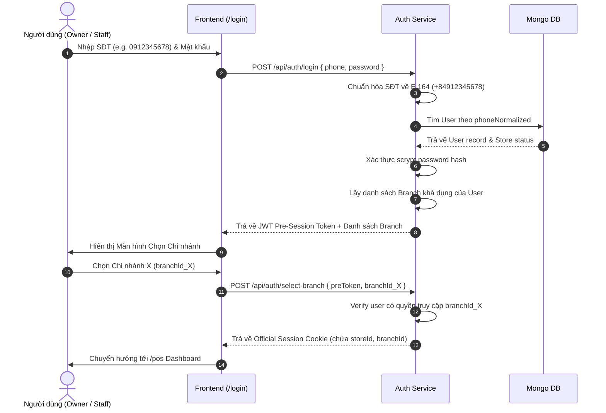

# Luồng Đăng nhập & Xác thực (Authentication & Session)

Tài liệu chi tiết cơ chế Đăng nhập và Session trong hệ thống Multi-Tenant.

## 1. Luồng Đăng nhập Merchant (Store Owner & Staff)

## 2. Chuẩn hóa Số điện thoại E.164
Tất cả các số điện thoại đầu vào được quy chuẩn về định dạng E.164 trước khi lưu vào DB hoặc tìm kiếm:
- `0912345678` -> `+84912345678`
- `84912345678` -> `+84912345678`
- `+84912345678` -> `+84912345678`

## 3. Super Admin Dedicated Auth Realm
Tài khoản Super Admin hoàn toàn tách biệt với merchant database:
- Khu vực đăng nhập riêng: `/super-admin/login`
- Đăng nhập sử dụng biến môi trường: `SUPER_ADMIN_PHONE`, `SUPER_ADMIN_PASSWORD_HASH`, `SUPER_ADMIN_AUTH_SECRET`.
